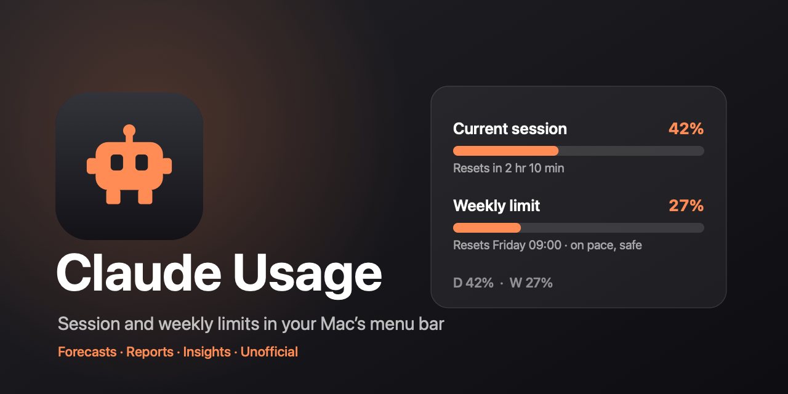
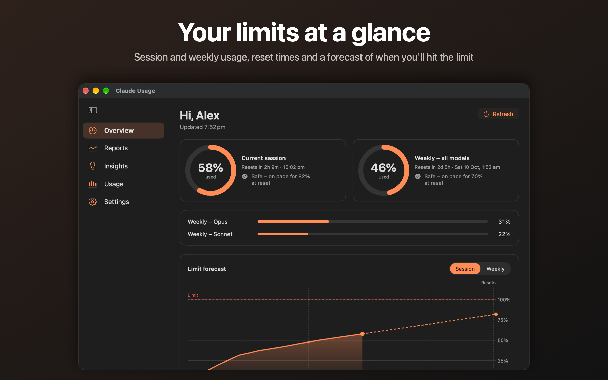
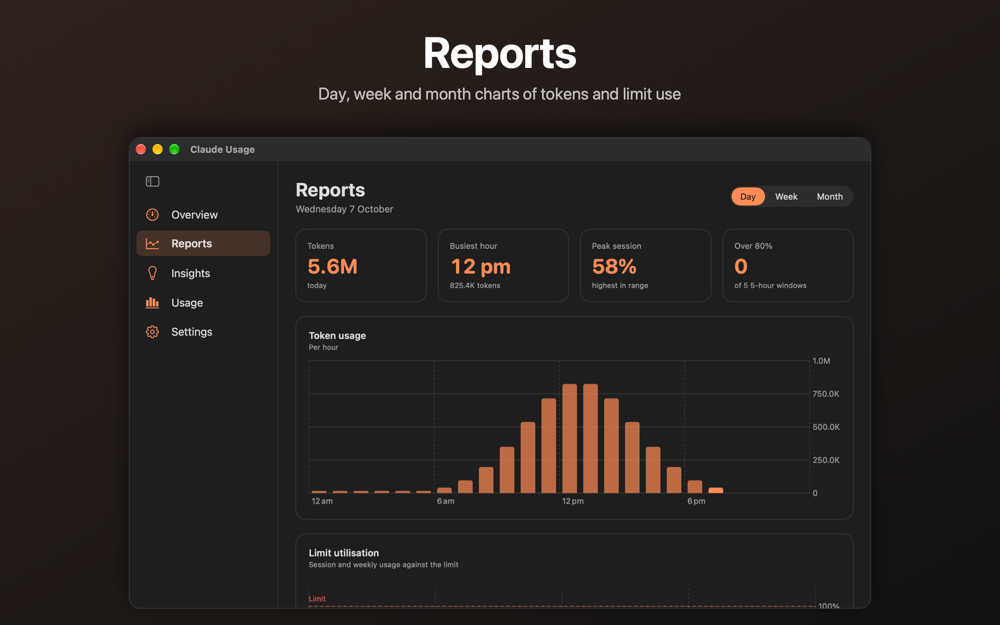
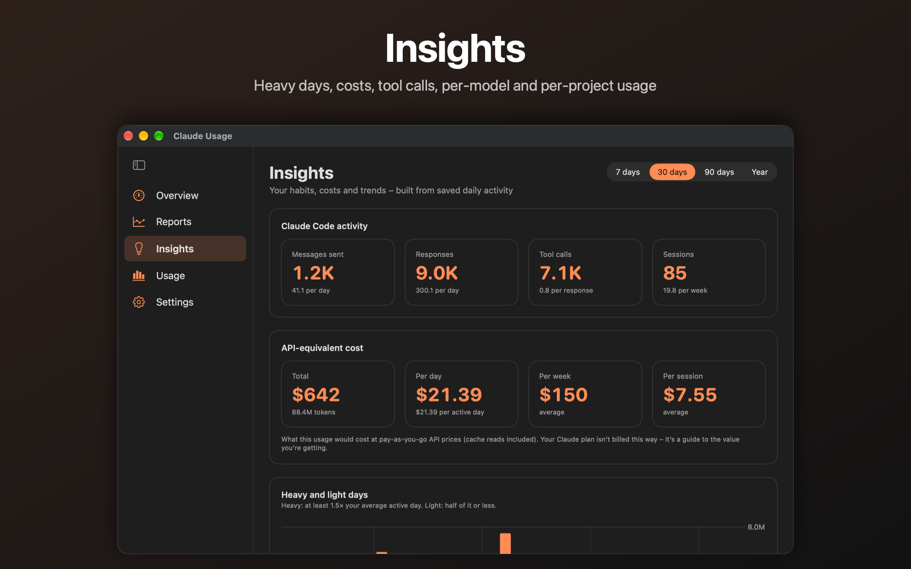
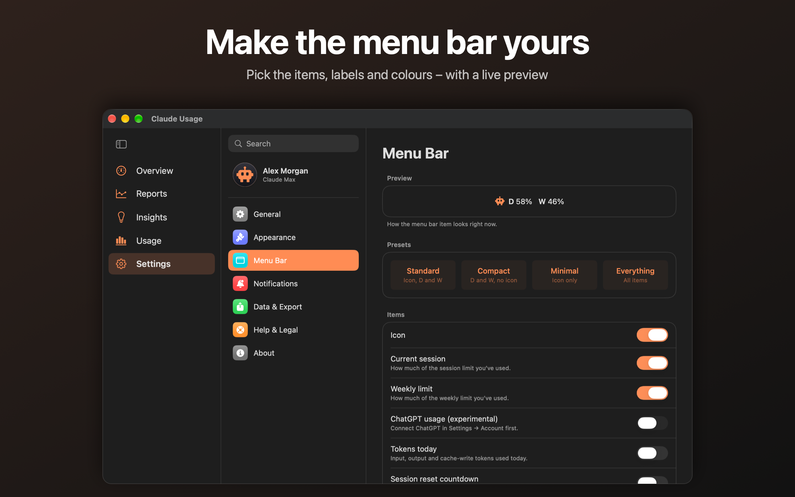
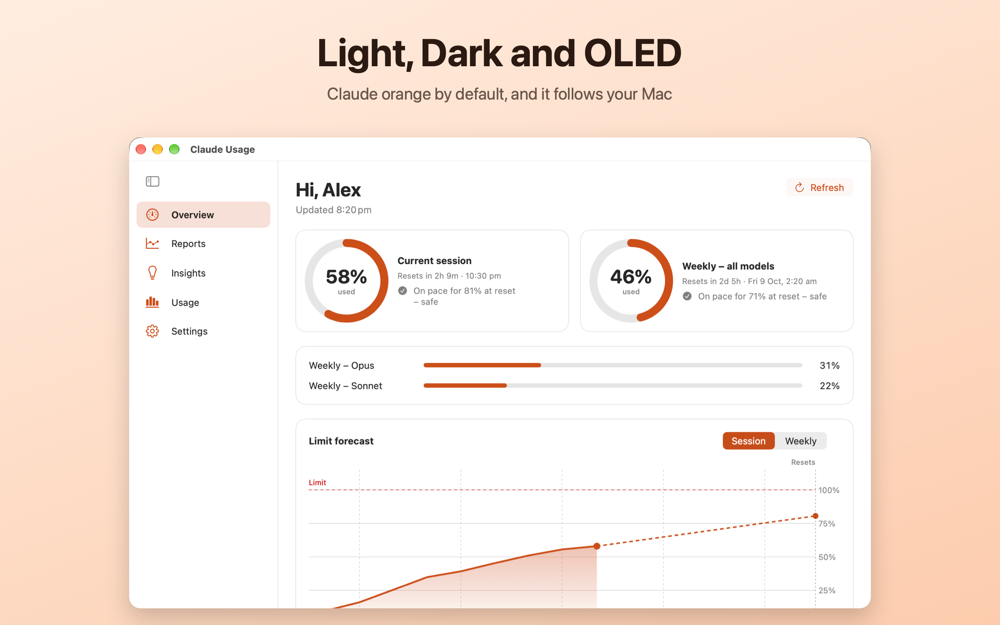
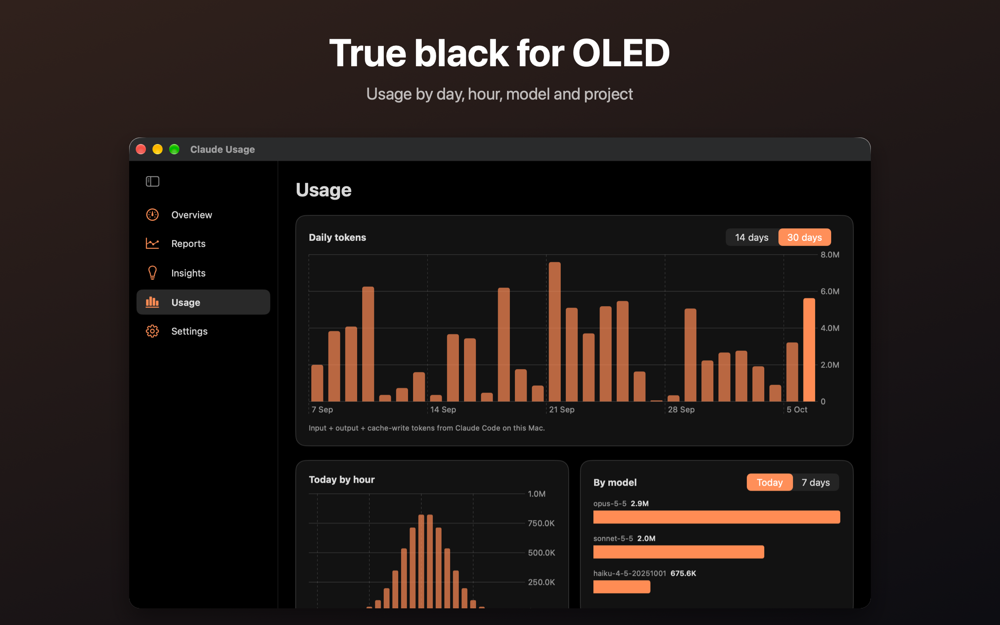
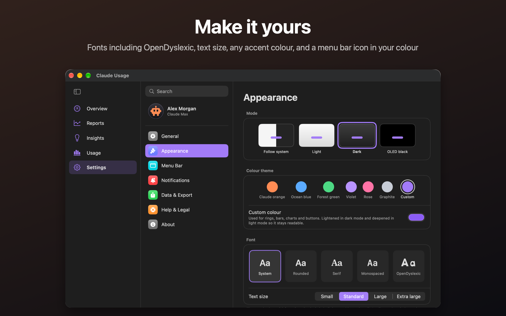
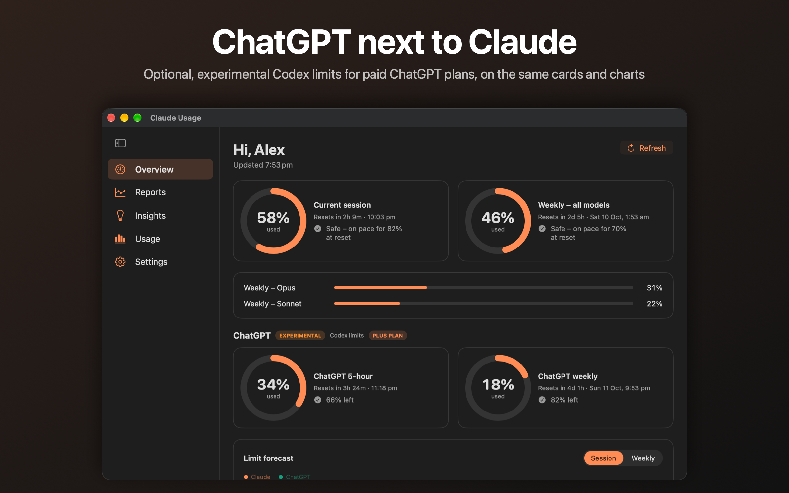

<p align="center"></p>

# Claude Usage – Claude Code usage tracker for the macOS menu bar

[](https://github.com/Ol775/Claude-Usage/releases/latest)
[](LICENSE)


**Claude Usage** is a free, open-source Mac app that shows your **Claude Code session and weekly usage limits** in the menu bar, with reset times, forecasts of when you'll hit the limit, and charts of your token usage. It's a native Swift and SwiftUI app for macOS 13 and later (the download runs natively on both Apple silicon and Intel Macs), with Light, Dark and OLED black themes. Current version: <!--v-->v0.11.0 beta<!--/v-->.

Keep an eye on how much of your Claude plan (Pro or Max) you've used, avoid hitting the limit mid-task, and see what your usage would cost at API prices. The source is in [`ClaudeUsage/`](ClaudeUsage).

## Features

- Real **session** and **weekly** limits with reset times (same numbers as Claude Code's `/usage`)
- **Forecasts** of when you'll hit a limit at your current pace – weekly forecasts also learn from your saved history – plus early-warning notifications
- **Reports**: day / week / month graphs of tokens and limit utilisation, with peaks per session and per week
- **Insights**: heavy and light days, sessions per day/week, messages, tool calls, API-equivalent cost, per-model and per-project usage, and a yearly heatmap
- Optional, **experimental** **ChatGPT (Codex) usage** for paid plans: connect through OpenAI's Codex CLI sign-in to see your Codex limits next to Claude's – on the Overview, in the menu bar menu, as a menu bar item (`G 34%`) and on the forecast and report charts
- Activity is saved on your Mac, so history outlives Claude Code's own log clean-up
- Light / Dark / **OLED black** / Follow system, six colour themes plus **any custom colour** (Claude orange by default)
- **Make it yours**: five fonts including the built-in **OpenDyslexic**, four text sizes, card corners, your own greeting name, a **menu bar icon in any colour**, and your profile picture in the sidebar
- Menu bar display options, configurable alert thresholds, CSV export, copy-summary, optional local profile photo
- Sign in/out through Claude's official login (via Claude Code)
- **Help & Legal** in Settings: terms, privacy notes and a Report a Bug button
- **Updates**: notifies when a newer version is on GitHub, and **Update Now** downloads the signed release with a progress bar, verifies it, swaps it in (keeping a backup) and relaunches – no Terminal needed. `./update.sh` does the same from the command line

Limits come from Claude Code's login in your own keychain; nothing is stored in this repo.
API-equivalent costs use Anthropic's published API prices and are only a guide – a Claude plan isn't billed that way.
Unofficial – not affiliated with Anthropic.

## Screenshots

<table>
<tr>
<td width="50%"></td>
<td width="50%"></td>
</tr>
<tr>
<td width="50%"></td>
<td width="50%"></td>
</tr>
<tr>
<td width="50%"></td>
<td width="50%"></td>
</tr>
<tr>
<td colspan="2"></td>
</tr>
<tr>
<td colspan="2"></td>
</tr>
</table>


## Install

Requires macOS 13 or later and [Claude Code](https://claude.com/claude-code) signed in on the same Mac (Claude Usage reads its login and logs).

**Option 1 – DMG.** Download `Claude-Usage-<version>.dmg` from the [latest release](https://github.com/Ol775/Claude-Usage/releases/latest), open it and drag *Claude Usage* to *Applications*.

**Option 2 – Terminal.** One line; it downloads the latest DMG, installs to `/Applications` and opens the app:

```sh
curl -fsSL https://raw.githubusercontent.com/Ol775/Claude-Usage/main/install.sh | zsh
```

**Option 3 – Homebrew.** Installs the same DMG and clears the macOS quarantine flag, so there's no first-launch prompt:

```sh
brew install --cask Ol775/tap/claude-usage
```

**Option 4 – Build from source** (needs the Xcode command line tools):

```sh
git clone https://github.com/Ol775/Claude-Usage.git
cd Claude-Usage/ClaudeUsage && ./build.sh      # then copy "Claude Usage.app" to /Applications
./make-dmg.sh                                  # optional: builds dist/Claude-Usage-<version>.dmg
```

### First launch

The app is ad-hoc signed (there's no paid Apple developer certificate), so macOS may refuse to open it the first time. Right-click the app, choose **Open**, then **Open** again. Or run:

```sh
xattr -dr com.apple.quarantine "/Applications/Claude Usage.app"
```

The terminal and Homebrew installs do this for you. Every release also ships a `.sha256` file if you want to check the download (`shasum -a 256 Claude-Usage-<version>.dmg`); the terminal install checks it automatically.

### Updating

The app checks GitHub releases for new versions and downloads the disk image in the background with a progress bar, verifies its signature and checksum, then asks you to restart. If a copy can't replace itself (for example it's running from the disk image), it downloads the verified installer to your Downloads folder instead. No developer tools needed (if a release download fails it falls back to building from source). You can also run `./update.sh` from a clone, or just re-run the install command above.

## Reporting bugs

Use **Settings → Help & Legal → Report a Bug** in the app (it fills in your version and macOS), or [open an issue](https://github.com/Ol775/Claude-Usage/issues/new) here. Please don't paste tokens or private logs.

## Roadmap

Claude Usage is in **beta**. See the [roadmap to 1.0](ROADMAP.md) for what's planned.

## Support the project

Claude Usage is free and open source. If it's useful, you can [buy me a coffee](https://buymeacoffee.com/ol775) – entirely optional, and always appreciated.

[](https://buymeacoffee.com/ol775)

## FAQ

**How do I check my Claude Code usage limits on a Mac?**
Install Claude Usage and it shows your current session and weekly limits in the menu bar (for example `D 58%  W 46%`), using the same numbers as Claude Code's `/usage` command.

**Does it work with Claude Pro and Max?**
Yes. It reads the limits for whichever Claude account Claude Code is signed in to.

**When will I hit my Claude usage limit?**
The app forecasts it from your recent pace and warns you with a notification before you get there. Forecasts are estimates, not guarantees.

**Can it show my ChatGPT usage too?**
Yes, as an **experimental** option, for **paid** ChatGPT plans (Plus, Pro, Business or Enterprise). Install OpenAI's [Codex CLI](https://github.com/openai/codex) (`brew install codex`), then choose **Settings → Account → ChatGPT → Connect**. It shows your Codex usage limits (a 5-hour and a weekly window) next to Claude's. Free plans aren't supported. Nothing is read until you connect, and the app only reads Codex's saved sign-in to ask ChatGPT for your limits – it never changes, copies or stores it.

**Is it official, and is it safe?**
It's an unofficial, open-source app, not affiliated with Anthropic. It runs on your Mac, has no analytics, and only talks to Anthropic (for your limits), ChatGPT (only if you connect it) and GitHub (for updates). The code is all here to read.

**How do I update it?**
It checks for new versions, downloads them in the background and asks you to restart. See [Updating](#updating).

## Security

Updates are signed with an offline key and verified before they install; the app reads only your own Claude Code login and logs. Details, and how to report a problem privately, are in [SECURITY.md](SECURITY.md).

## Privacy and legal

Everything stays on your Mac. The app only talks to Anthropic (for your usage limits), ChatGPT (for your ChatGPT limits, only if you connect it) and GitHub (for updates); there are no analytics. Limits come from Claude Code's login in your own keychain, and nothing is stored in this repo. API-equivalent costs use Anthropic's published API prices and are only a guide – a Claude plan isn't billed that way. The full terms are in the app under Settings → Help & Legal.

**Unofficial – not affiliated with or endorsed by Anthropic.** "Claude" and "Anthropic" are trademarks of Anthropic, PBC; "ChatGPT", "Codex" and "OpenAI" are trademarks of OpenAI. Provided as is, with no warranty. The code is released under the [MIT licence](LICENSE).
